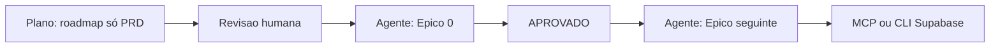

# Playbook de prompts — ContentFlow.ai (Plano vs Agente)

Este documento implementa a governança acordada: **não misturar** pedido de roadmap, regras de PM/QA, template de outro produto e operações Supabase/MCP na **mesma mensagem**.

## Modo Plano vs Modo Agente

| Objetivo | Modo no Cursor | O que pedir |
|----------|----------------|-------------|
| Roadmap (épicos e user stories alinhados ao PRD) | **Plano** | Apenas planejamento; sem implementar código; sem MCP. |
| Ajustes de arquitetura / trade-offs | **Plano** | Perguntas pontuais; ainda sem código. |
| Implementar um épico ou feature | **Agente** | Uma entrega clara por vez; referência ao plano aprovado. |
| Governança PM/QA (um épico por vez, `APROVADO`) | **Agente** | Mensagem **curta e separada** no início da fase de implementação. |
| Migrations + deploy Edge Functions (MCP ou CLI) | **Agente** | **Mensagem separada**, depois que SQL e funções existem no repositório. Se o MCP falhar (timeout/rede), usar [docs/ci-cd.md](ci-cd.md) (SQL Editor ou Supabase CLI). |

## O que nunca misturar num único prompt

1. **Plano arquitetural** (épicos, US, pilares RLS / Stripe / BYOK).
2. **Template de outro SaaS** (ex.: “ControlAI” com `empresa_id`, chat, `log-action`, `src/app/`).
3. **Regras humanas** (“só continuo após APROVADO”).
4. **Infra** (MCP Supabase, `.env.local`, Netlify).

Misturar faz o modelo priorizar **ação** (código/MCP) ou **fundir domínios errados**, mesmo quando o cabeçalho pedia só plano.

## PRD e domínio único

- Fonte de verdade do produto: [`.lovable/docs/prd.md`](../.lovable/docs/prd.md) — **ContentFlow.ai** (`agencia_id`, `clientes_workspace`, gerador de conteúdo, etc.).
- Plano de roadmap do repositório: `.cursor/plans/contentflow_saas_roadmap_*.plan.md` (ajustar nome do ficheiro conforme existir no projeto).
- **Não** colar blueprints de outros produtos nos prompts de **Modo Plano**. Se quiser só a *estrutura* (granularidade de épicos), diga explicitamente: *“Mesma granularidade de épicos/user stories, 100% alinhado ao PRD ContentFlow anexo; ignore qualquer outro template.”*

## Nomenclatura: “Épico 1” vs passo operacional

- No roadmap, **Épico 1** costuma ser auth + tenant + RLS (conceito de produto).
- **Migrations e deploy** são **passo operacional Supabase** (pode ser após Épico 0 ou quando o SQL/functions já estiverem no repo). Evite titular isso como “Épico 1” para não colidir com o plano.

## Sequência sugerida de mensagens

## Modelos de prompt (copiar e colar)

### Mensagem A — só roadmap (use **Modo Plano**)

> Com base no PRD em `.lovable/docs/prd.md` e no estado atual do repositório, gere um plano de implementação faseado (épicos + user stories) para ContentFlow.ai (Vite/React, Supabase, Stripe, Brevo), com foco em multi-tenant (RLS), Stripe + modelo BYOK, gestão segura de chaves API, e fase final **Preparação para Lançamento** (E2E, Netlify/CI, Go-Live). Não implemente código nem chame MCP. Não use templates de outros produtos.

### Mensagem B — governança (use **Modo Agente**, opcional)

> Regras: um épico por vez; ao terminar um épico completo, parar e esperar minha resposta **APROVADO** ou **REVISÃO NECESSÁRIA** antes do próximo.

### Mensagem C — implementação (use **Modo Agente**)

> Implemente **apenas** o Épico [N] conforme o plano aprovado [caminho ou nome do ficheiro do plano]. Não altere o ficheiro do plano.

### Mensagem D — Supabase (use **Modo Agente**)

> Aplique as migrations em `supabase/migrations/` e faça deploy das Edge Functions em `supabase/functions/` via MCP Supabase. Se o MCP falhar, documente o erro e use os passos em `docs/ci-cd.md` (SQL Editor / CLI). Secrets já estão no projeto Supabase; `VITE_SUPABASE_*` no `.env.local` e Netlify.

## Referências

- Arquitetura técnica: [docs/architecture.md](architecture.md)
- CI/CD e ordem deploy: [docs/ci-cd.md](ci-cd.md)
- Go-live: [docs/release-checklist.md](release-checklist.md)
